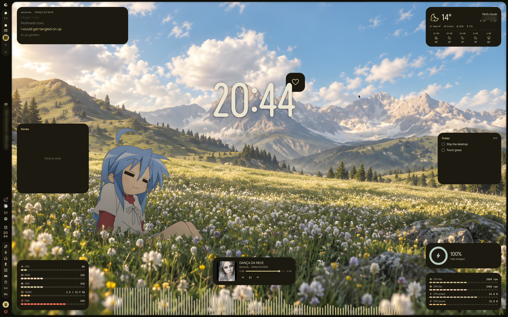
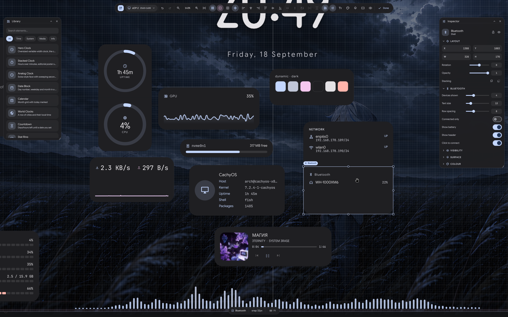
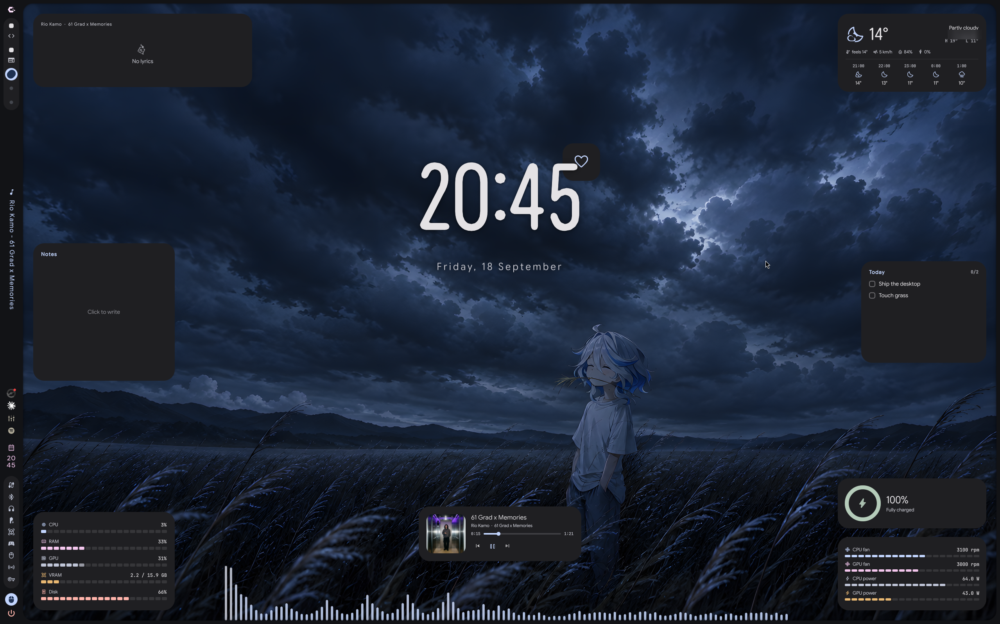

# Hyprforge

[](https://github.com/c0pperlane/hyprforge/releases)
[](https://github.com/c0pperlane/hyprforge/releases/latest)

A desktop widget designer for Hyprland. Place widgets anywhere, drag them
around with real snapping, and keep them on your desktop — 51 of them, from
clocks and system meters to lyrics, sticky notes and an audio spectrum.

Press a key, the desktop becomes a canvas. Press it again, it's a desktop.

Lightweight: a widget that isn't on screen isn't running. Cover the desktop
and every timer, poll and API call stops until you can see it again.



Drag widgets straight out of the library onto the canvas, drag them around to
reposition, drag their handles to resize. Everything snaps — to a grid, to
your screen edges and safe area, to other widgets' edges and centres, and to
the spacing your layout already uses, so a stack comes out evenly padded
without you measuring anything. Hold and nudge with the arrow keys for the
last pixel.



The inspector on the right edits whatever is selected: position, size,
rotation, opacity, per-corner radius, colours, fonts, and the conditions that
decide when a widget is on the desktop at all.

Colours follow your wallpaper — same layout, different wall:



## Requirements

| | |
|---|---|
| [Quickshell](https://quickshell.org) | **required** — Hyprforge is a Quickshell config |
| Hyprland | **required** |
| [caelestia-shell](https://github.com/caelestia-dots/shell) | *optional* — nicer system metrics. Everything else, lyrics included, works without it; only the audio spectrum genuinely needs it. See [docs/caelestia.md](docs/caelestia.md). |

## Install

```sh
curl -fsSL https://raw.githubusercontent.com/c0pperlane/hyprforge/main/install.sh | bash
```

Or read it first, which you should:

```sh
git clone https://github.com/c0pperlane/hyprforge ~/Projects/hyprforge
~/Projects/hyprforge/install.sh
```

Per-user, no root. It installs the shell to `~/.config/quickshell/hyprforge`,
the CLI to `~/.local/bin`, a systemd user unit that autostarts it, and a
"Desktop Designer" entry in your launcher. Re-run it to upgrade; your layout
is left alone.

Then bind a key:

```
bind = SUPER ALT, D, exec, hyprforge toggle
```

## Uninstall

```sh
hyprforge uninstall                # asks before touching your layout
./install.sh --uninstall --purge   # remove the layout too
```

## Using it

```sh
hyprforge              # open the designer
hyprforge toggle       # ...or close it
hyprforge widgets      # show/hide the desktop layer
hyprforge status       # what's running, and what it's keeping awake
hyprforge sample       # list bundled layouts
hyprforge --help       # everything else
```

Your layout lives in `~/.config/hyprforge/layout.json`.

## Sharing a rice

A whole look — every widget, position, colour and condition — is one file:

```sh
hyprforge export my-rice.hfrice
hyprforge import theirs.hfrice
```

Importing keeps your old layout as `.bak`, so trying someone's rice isn't a
commitment. Shipping Hyprforge in your own dotfiles or distro? There's a
`PKGBUILD`, and [docs/architecture.md](docs/architecture.md) covers the
layout.

## Credit

MIT, with one condition: **if you publish something that uses Hyprforge, link
back to it.** A rice, a dotfiles repo, a distro image, a fork — put a visible
link in your README, about page, or package metadata:

```
Desktop widgets by Hyprforge — https://github.com/c0pperlane/hyprforge
```

That's all. No permission to ask, no restrictions on what you build, nothing
to fill in. Just a link where people can see it. ([LICENSE](LICENSE))

## Docs

- [How it's built](docs/architecture.md) — the two halves, multi-monitor, and why off-screen widgets cost nothing
- [The editor](docs/editor.md) — snapping, visibility conditions, corners, styles, typography
- [Widgets](docs/widgets.md) — what ships, and how to write another
- [caelestia-shell](docs/caelestia.md) — what changes with and without it

## FAQ

**My widgets vanished after a reboot.**
Usually a display that renamed itself between boots (`eDP-2` one time, `eDP-1`
the next — laptops do this). Hyprforge records a stable identity and reconciles
on load, so it should recover on its own. If it doesn't, open the designer and
check the monitor picker in the toolbar: your widgets are probably placed on an
output that isn't there.

**Nothing happens when I press the keybind.**
`hyprforge status` first. If it says *not running*, the daemon didn't start —
`systemctl --user status hyprforge.service`. If it says *running*, your
compositor isn't reaching the binary; check `~/.local/bin` is on your `PATH`.

**It didn't start on boot.**
Autostart is a systemd user unit, not a compositor `exec`, because
`graphical-session.target` is the thing that actually knows when a compositor
exists. Check `systemctl --user is-enabled hyprforge.service`. If you also have
an `exec-once` for it, remove that — two mechanisms race.

**Every widget is drawn twice.**
Two daemons. `hyprforge stop`, then `hyprforge start`. The unit uses `qs -n`,
which refuses a second instance, so this only happens if something else started
one.

**`status` says "idle — nothing held" but my widgets are on screen.**
That's correct and it's the point: it means no widget is currently polling.
Services are released the moment a window covers the desktop, and the message
tells you *why* it's idle.

**CPU/RAM/GPU show nothing.**
Without caelestia-shell these come from `/proc` and `sysfs`.
`qs -c hyprforge ipc call diag backend` prints which source is live and what it
currently reads. GPU load needs either an amdgpu/intel card exposing
`gpu_busy_percent`, or `nvidia-smi`.

**The visualiser says it needs caelestia-shell.**
It does, and it's the one thing that genuinely can't be replaced — the audio
spectrum is an FFT of the monitor stream done in caelestia's C++, and there's
no substitute in Qt.

**I can't type in the sticky note.**
Click directly on the text. A layer-shell surface only takes keyboard focus
while something on it wants typing; clicking elsewhere on your desktop drops it
again, which is intended.

**Can I use this without caelestia-shell?**
Yes — that's what *optional* means above. Lyrics come from
[lrclib.net](https://lrclib.net) instead, a free public API; CPU/RAM/GPU/disk
come from `/proc` and `sysfs`. The one thing that doesn't have a substitute is
the audio spectrum, for the reason above. [docs/caelestia.md](docs/caelestia.md)
has the full comparison.
